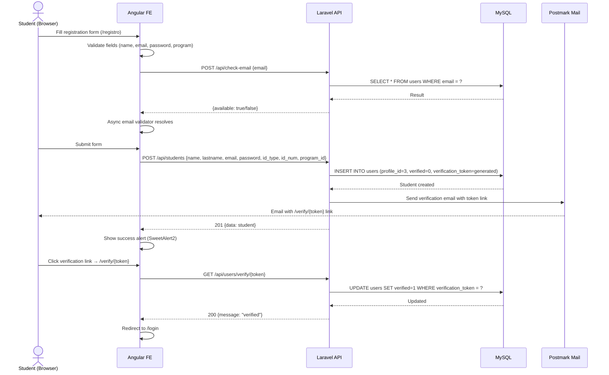
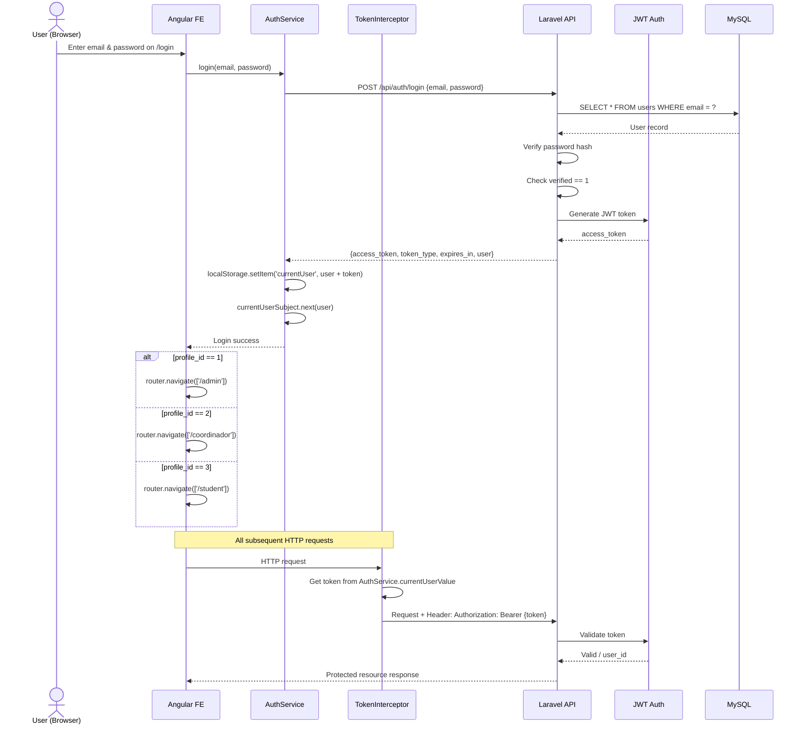
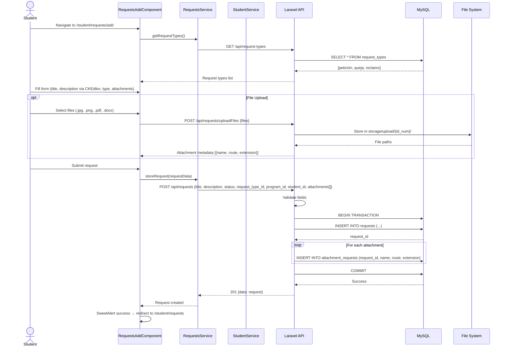
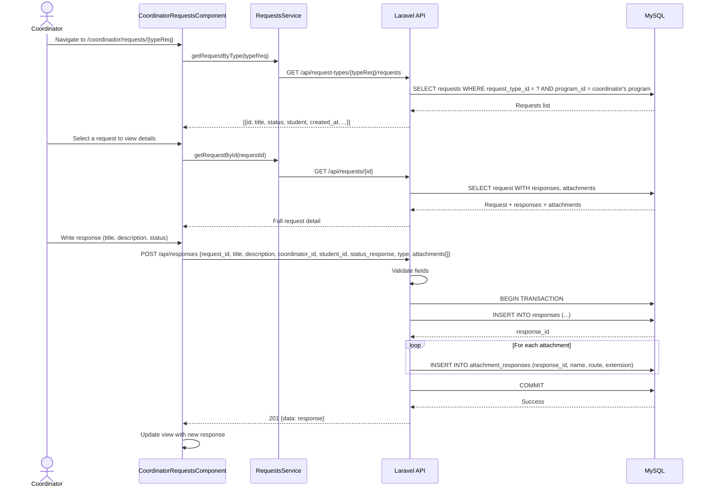
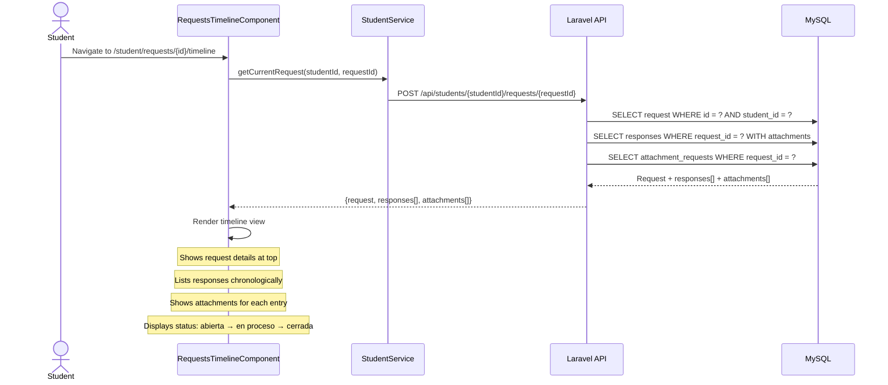
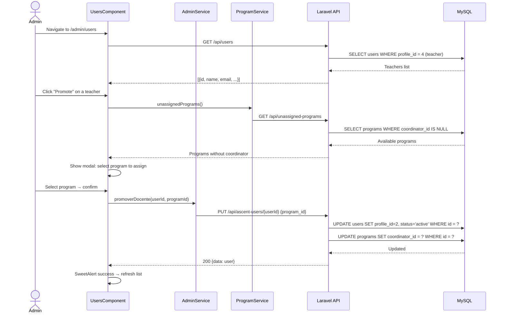
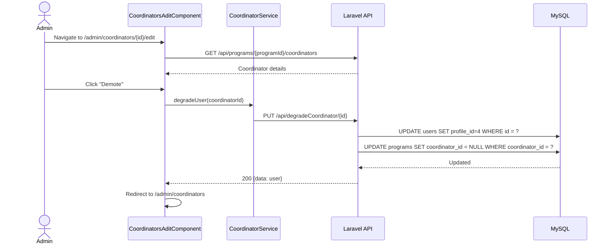
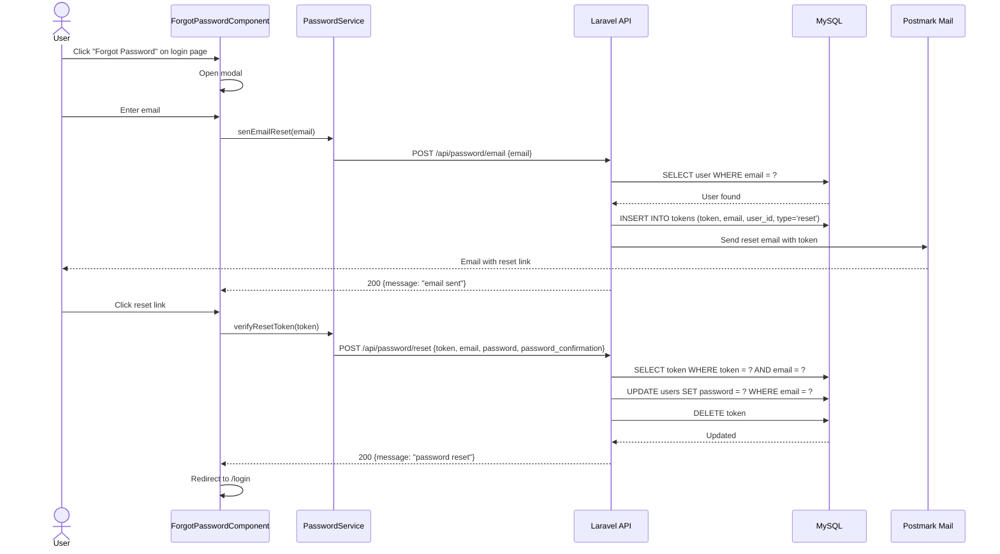
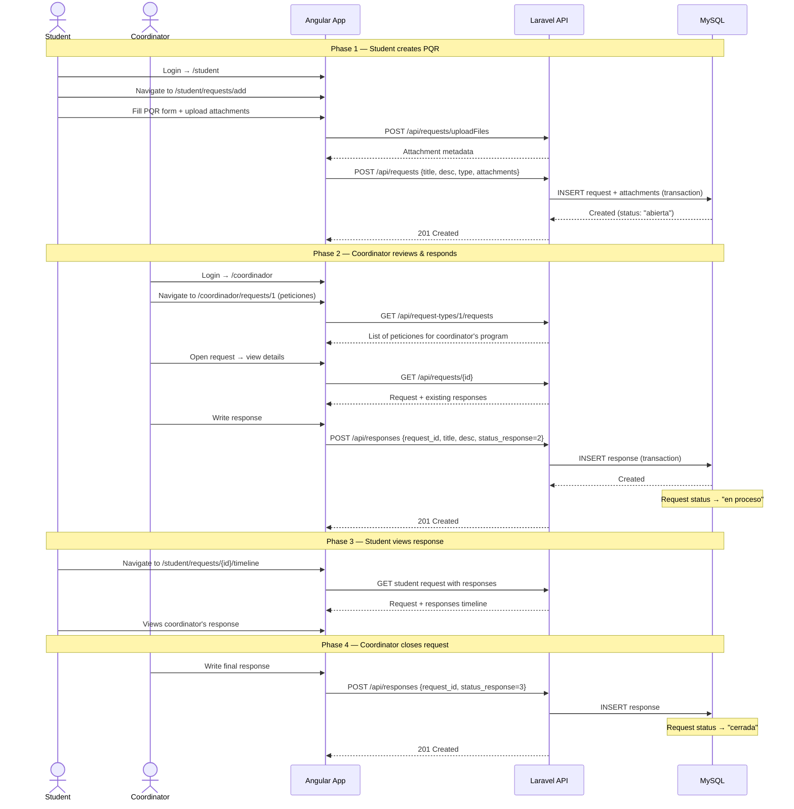
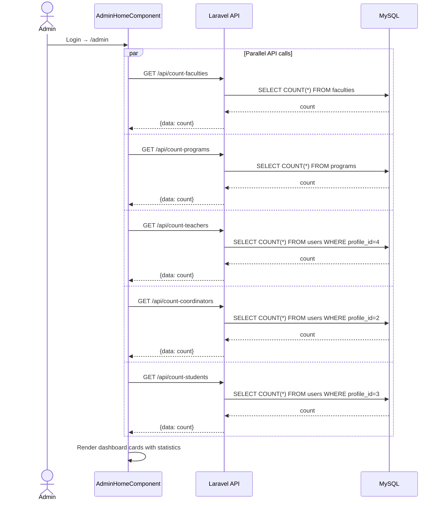

# SIGPQR — Sequence Diagrams

All diagrams use Mermaid syntax. Render with any Mermaid-compatible viewer (VS Code extension, GitHub, mermaid.live, etc.).

---

## 1. Student Registration & Email Verification

---

## 2. Login & JWT Authentication

---

## 3. Student Creates a PQR (Request)

---

## 4. Coordinator Reviews & Responds to a Request

---

## 5. Student Views Request Timeline

---

## 6. Admin Promotes Teacher to Coordinator

---

## 7. Admin Demotes Coordinator to Teacher

---

## 8. Password Reset Flow

---

## 9. Full PQR Lifecycle (End-to-End)

---

## 10. Admin Dashboard Data Loading

